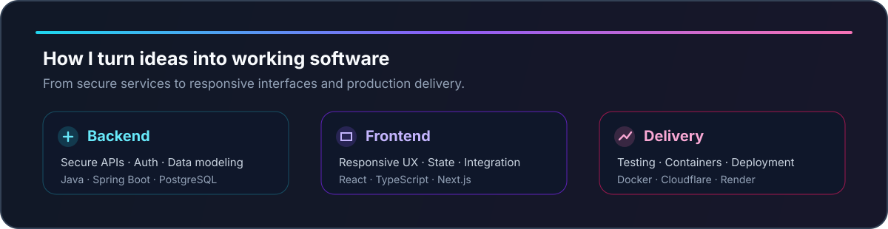

  

  
  

## Hello, I'm Mayank

I'm a full-stack developer focused on building useful, dependable products—not just demos. I enjoy turning an idea into the complete system: accessible interfaces, secure APIs, well-structured databases, automated tests, and production deployments.

- Building with **Java, Spring Boot, React, TypeScript, Python, and PostgreSQL**
- Interested in **backend engineering, full-stack products, API design, and practical AI**
- Currently refining production-ready projects and strengthening system-design fundamentals
- Open to **software engineering and full-stack development opportunities**

## Featured work

<table>
  <tr>
    <td width="50%" valign="top">
      <h3>SpendSnap</h3>
      
An installable, mobile-first expense manager with Google authentication, natural-language entry, on-device receipt OCR, budgets, history, and spending insights.

      

        <strong>React · TypeScript · Spring Boot · PostgreSQL · PWA</strong>
      

      <a href="https://github.com/mayank2OP/SpendSnap">Source</a>
      ·
      <a href="https://app.spendsnap.workers.dev">Live app</a>
    </td>
    <td width="50%" valign="top">
      <h3>StockPilot</h3>
      
A responsive stock-research interface for asynchronous multi-agent analysis, rules-based signals, risk assessment, technical metrics, attributable news, and backtesting.

      

        <strong>Next.js · React · TypeScript · REST APIs · JWT</strong>
      

      <a href="https://github.com/mayank2OP/finance-stock-analyzer-frontend">Frontend</a>
      ·
      <a href="https://github.com/mayank2OP/finance-stock-analyzer">Backend</a>
      ·
      <a href="https://stockpilot-analyzer.vercel.app">Live app</a>
    </td>
  </tr>
  <tr>
    <td width="50%" valign="top">
      <h3>Secure URL Shortener</h3>
      
A layered URL-shortening service with Base62 encoding, JWT authentication, click analytics, documented REST APIs, and a containerized local environment.

      

        <strong>Java 21 · Spring Boot · MySQL · JWT · Docker</strong>
      

      <a href="https://github.com/mayank2OP/urlshortener">Source</a>
    </td>
    <td width="50%" valign="top">
      <h3>How I build</h3>
      
I care about maintainable boundaries, honest feature claims, clear documentation, responsive UX, secure configuration, and testing the critical paths before deployment.

      

        <strong>Product thinking · Clean APIs · Testing · Deployment</strong>
      

      <a href="https://github.com/mayank2OP?tab=repositories">View all repositories</a>
    </td>
  </tr>
</table>

## Technologies

  
  
  
  
  
  
  
  
  
  
  
  

## Engineering focus

  

---

  <strong>Good software should be useful first—and impressive because it works.</strong>

  <a href="https://github.com/mayank2OP">GitHub</a>
  ·
  <a href="https://app.spendsnap.workers.dev">SpendSnap</a>
  ·
  <a href="https://stockpilot-analyzer.vercel.app">StockPilot</a>

  

