  

  
  
  

  
  
  

## Signal / About

I am a **full-stack developer** who turns product ideas into complete, dependable systems—from expressive interfaces and secure APIs to relational data and production delivery.

- Building with **Java, Spring Boot, React, TypeScript, Python, and PostgreSQL**
- Interested in **backend engineering, product-minded full-stack work, API design, and practical AI**
- Focused on maintainable boundaries, clear UX, secure configuration, and tested critical paths
- Open to **software engineering and full-stack development opportunities**

## Selected systems

  

<table>
  <tr>
    <td width="33%" valign="top">
      <h3>01 / SpendSnap</h3>
      
An installable, mobile-first expense companion with Google authentication, natural-language entry, on-device receipt OCR, budgets, history, and spending insights.

      
<strong>React · TypeScript · Spring Boot · PostgreSQL · PWA</strong>

      <a href="https://app.spendsnap.workers.dev">Live product ↗</a>
      &nbsp;·&nbsp;
      <a href="https://github.com/mayank2OP/SpendSnap">Source ↗</a>
    </td>
    <td width="33%" valign="top">
      <h3>02 / StockPilot</h3>
      
A full-stack stock-research system that turns asynchronous multi-agent analysis into a calm, attributable decision workspace.

      
<strong>Next.js · TypeScript · FastAPI · Agents · JWT</strong>

      <a href="https://stockpilot-analyzer.vercel.app">Live product ↗</a>
      &nbsp;·&nbsp;
      <a href="https://github.com/mayank2OP/finance-stock-analyzer">Source ↗</a>
    </td>
    <td width="33%" valign="top">
      <h3>03 / LinkForge</h3>
      
A secure URL platform with Base62 encoding, JWT access, click analytics, documented REST APIs, and containerised delivery.

      
<strong>Java 21 · Spring Boot · MySQL · JWT · Docker</strong>

      <a href="https://github.com/mayank2OP/urlshortener">Source ↗</a>
    </td>
  </tr>
</table>

## Connected practice

  

## Technology constellation

  
  
  
  
  
  
  
  
  
  
  

## Coding signals

<table>
  <tr>
    <td width="33%" align="center" valign="top">
      <h3>GitHub</h3>
      
Production projects, APIs, interfaces, and ongoing experiments.

      <a href="https://github.com/mayank2OP?tab=repositories"><strong>Explore systems ↗</strong></a>
    </td>
    <td width="33%" align="center" valign="top">
      <h3>LeetCode</h3>
      
Algorithmic problem solving and data-structure practice.

      <a href="https://leetcode.com/u/mayank460/"><strong>View profile ↗</strong></a>
    </td>
    <td width="33%" align="center" valign="top">
      <h3>GeeksforGeeks</h3>
      
Consistent practice across programming and interview topics.

      <a href="https://www.geeksforgeeks.org/profile/mayankra39lx"><strong>View profile ↗</strong></a>
    </td>
  </tr>
</table>

---

  <strong>Good software should be useful first—and impressive because it works.</strong>

  <a href="https://github.com/mayank2OP">GitHub</a>
  &nbsp;·&nbsp;
  <a href="https://www.linkedin.com/in/mayank-rawat-540584286">LinkedIn</a>
  &nbsp;·&nbsp;
  <a href="https://leetcode.com/u/mayank460/">LeetCode</a>
  &nbsp;·&nbsp;
  <a href="https://app.spendsnap.workers.dev">SpendSnap</a>
  &nbsp;·&nbsp;
  <a href="https://stockpilot-analyzer.vercel.app">StockPilot</a>

  

